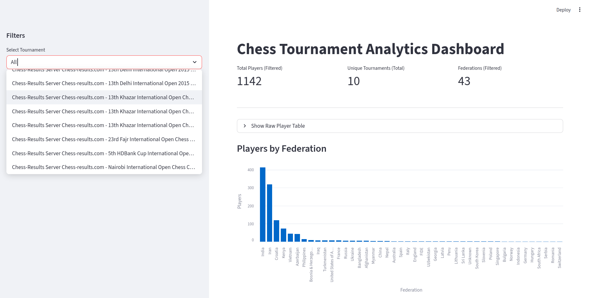
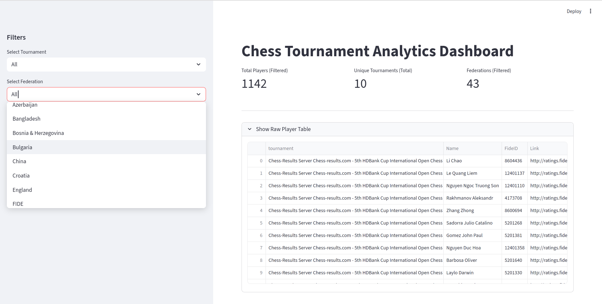
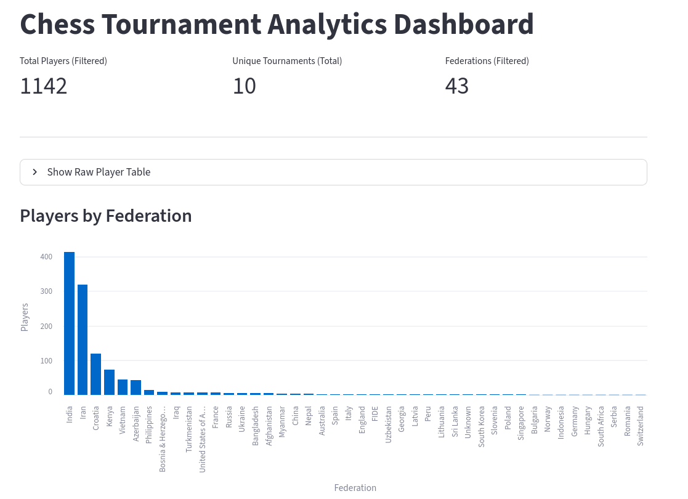
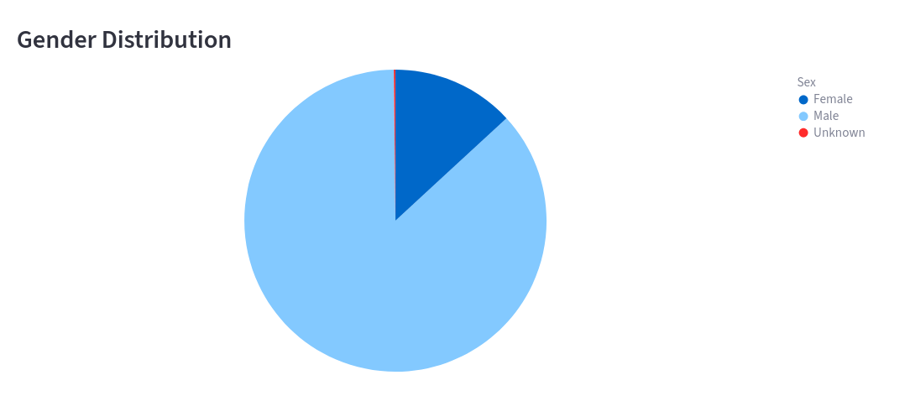
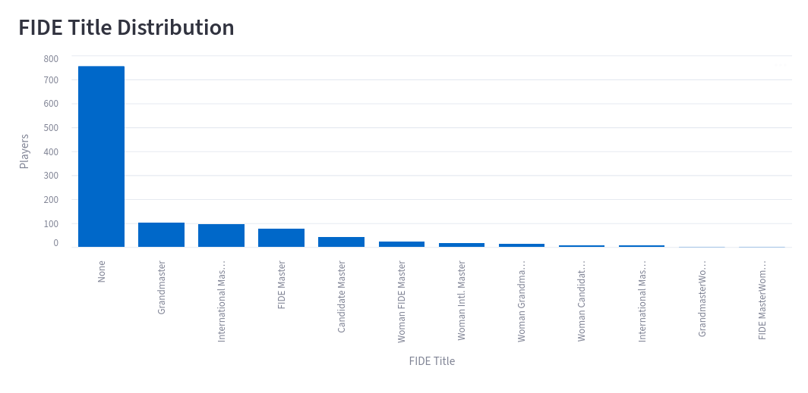
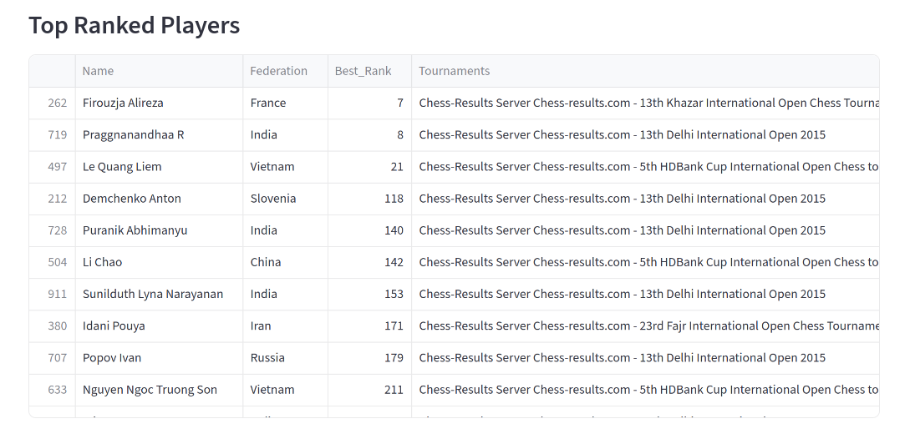
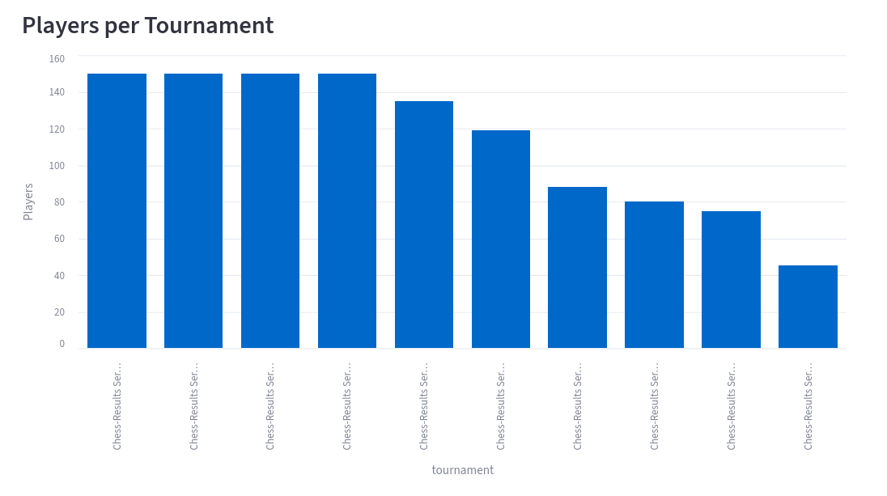

# Chess Tournament Data Pipeline

Automated data extraction and analytics pipeline for chess tournaments from chess-results.com with FIDE profile for players and Streamlit analytics dashboard.

The project supports two runtime modes:  
- `scrape` for data collection  
- `dashboard` for data exploration  

All data is stored in DuckDB inside a Docker-mounted folder.

---

## Pipeline Overview

1. Executes tournament search on chess-results.com using Selenium.
2. Applies tournament name filters and date range filters.
3. Collects tournament result page links.
4. Tracks processed tournament links in DuckDB to avoid reprocessing.
5. Downloads each tournament player table via HTTP.
6. Parses player tables using BeautifulSoup.
7. Normalizes table headers and injects missing player profile links.
8. Visits each player FIDE profile page with retry and timeout handling.
9. Enriches player records with FIDE metadata.
10. Persists all data into DuckDB.
11. Provides a Streamlit dashboard for analytics and filtering.

---

## Data Collected

### Tournament-Level Player Tables
For each tournament:
- Rank
- Player name
- Federation
- FIDE ID
- Player profile link
- All original tournament table columns

### Player Data (from FIDE profiles)
For each player:
- Federation
- Birth year
- Sex
- FIDE title
- World rank

All data is stored in DuckDB.

---

## Output Structure

Sample data is stored in:

- `processed_data/chess_data.duckdb`

The database contains:
- `tournaments` table for tracking state
- `players` table with player data

---

## Runtime Modes

### Scraping Mode

Runs tournament scraping and enrichment.

```bash
docker run -v $(pwd)/processed_data:/app/processed_data chess-scraper \
  --mode scrape \
  --start-date 01.01.2015 \
  --end-date 01.01.2016 \
  --queries "European Youth,World Youth"
````

### Dashboard Mode

Runs the Streamlit analytics UI.

```bash
docker run -p 8501:8501 \
  -v $(pwd)/processed_data:/app/processed_data \
  chess-scraper \
  --mode dashboard
```

Open in browser:

```
http://localhost:8501
```

---

## Dashboard Features

* Tournament filter  
  

* Federation filter  
  

* Players by federation chart  
  

* Gender distribution chart  
  

* FIDE title distribution chart  
  

* Top ranked players:
  * Best world rank per player
  * List of tournaments per player  
  

* Players per tournament chart  
  

---

## Fault Tolerance

* HTTP retries for FIDE profile scraping
* Timeout handling
* Resume-safe processing via DuckDB
* No duplicate tournament or player entries

---

## Project Structure

```text
.
├── list_chess_tournaments.py
├── dashboard.py
├── inspect_db.py
├── requirements.txt
├── Dockerfile
├── README.md
└── processed_data/
    └── chess_data.duckdb
```